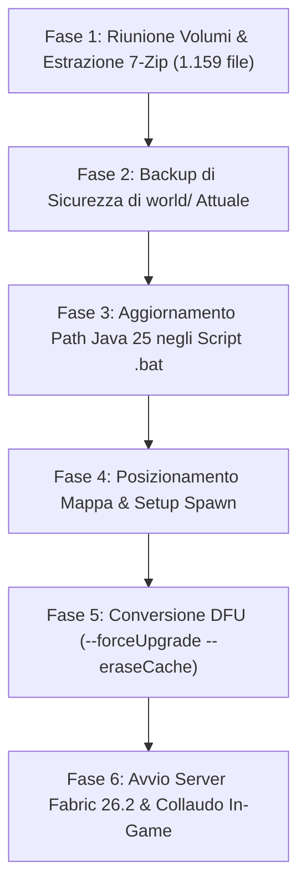

# Strategia di Conversione & Importazione Mappa Earth 1:1500 su Minecraft 26.2 Fabric

**Data Documento**: 27 Agosto 2026  
**Autore**: Antigravity (Pair Programmer) & Luca  
**Repository**: `server-minecraft` (`C:\Users\nemex\OneDrive\Documenti\GitHub\server-minecraft`)  
**Target Runtime**: Minecraft 26.2 (Fabric Loader, Java 25 Microsoft LTS)

---

## 1. Sintesi e Obiettivi

Il presente documento definisce la procedura operativa e le specifiche tecniche per:
1. **Unire ed estrarre** l'archivio multi-volume a 3 parti della mappa *Earth 1:1500 OSM-based with features* (versione 1.19.3, DataVersion 3105).
2. **Effettuare il backup di sicurezza** del mondo attuale presente sul server (`server-minecraft\world`).
3. **Allineare gli script batch** (`avvia.bat`, `aggiorna_mappa.bat`) al runtime Java 25 corretto presente sulla postazione di lavoro.
4. **Eseguire l'upgrade forzato** dei chunk tramite il DataFixerUpper (DFU) nativo di Minecraft 26.2 (`--forceUpgrade --eraseCache`) per convertire il formato a `DataVersion: 4903`.
5. **Configurare il punto di spawn** e validare la compatibilità con le 22 mod Fabric 26.2 installate.

---

## 2. Inventario e Diagnosi dei Componenti

### 2.1 File Archivio Mappa (3 Volumi)
L'archivio originale è suddiviso in tre volumi 7-Zip:

| File | Dimensione | Posizione Attuale | Ruolo |
|---|---|---|---|
| `earth_1-1500_osm-based_with-features_1-19-3.zip.001` | 4.38 GB (4.697.620.480 byte) | `C:\Users\nemex\Desktop\` (e `Downloads\`) | Volume 1 (Header e chunk emisfero ovest) |
| `earth_1-1500_osm-based_with-features_1-19-3.zip.002` | 4.38 GB (4.697.620.480 byte) | `C:\Users\nemex\Desktop\mappa server-minecraft\` | Volume 2 (Chunk continenti centrali) |
| `earth_1-1500_osm-based_with-features_1-19-3.zip.003` | 1.95 GB (2.092.364.499 byte) | `C:\Users\nemex\Desktop\mappa server-minecraft\` | Volume 3 (Chunk emisfero est + Indice Zip64 EOCD) |

- **Dimensione compressa totale**: 10.71 GB
- **Totale file contenuti**: 1.159 file (~1.156 regioni `.mca`, `level.dat`, `earth_...png`)
- **Estensione geografica**: 24.576 x 12.288 blocchi (scala 1:1500, proiezione equirettangolare)

### 2.2 Differenze di Struttura Dati (1.19.3 vs 26.2)

| Proprietà | Mappa Sorgente (1.19.3) | Server Target (26.2) |
|---|---|---|
| **DataVersion** | `3105` (WorldPainter / 1.19.3) | `4903` (Minecraft 26.2) |
| **Struttura Directory** | Root `region/`, `level.dat` | `dimensions/minecraft/overworld/region`, `poi/`, `data/` |
| **Range Altezza Y** | $Y \in [-64, 320]$ | $Y \in [-64, 320]$ (Compatibile al 100%) |
| **Punto Spawn Originale** | $X = 4608, Y = 63, Z = -1536$ | Configurabile via `server.properties` o NBT |
| **Coordinate Italia/Roma** | $X \approx +853, Z \approx -2860$ | Identiche su proiezione 1:1500 |

### 2.3 Runtime Java 25
- **Eseguibile validato**: `C:\Users\nemex\AppData\Roaming\PrismLauncher\java\java-runtime-epsilon\bin\java.exe` (OpenJDK 25.0.1+8-LTS Microsoft).
- **Adeguamento script**: Inserire il rilevamento prioritario di questo percorso in `avvia.bat` e `aggiorna_mappa.bat` prima di qualsiasi fallback generico.

---

## 3. Piano Operativo Dettagliato (Sequenza a 6 Fasi)



### Fase 1: Riunione dei Volumi ed Estrazione Completa
1. Copiare/spostare `earth_1-1500_osm-based_with-features_1-19-3.zip.001` nella cartella `C:\Users\nemex\Desktop\mappa server-minecraft\`.
2. Eseguire l'estrazione con 7-Zip a riga di comando:
   ```cmd
   "C:\Program Files\7-Zip\7z.exe" x -y "C:\Users\nemex\Desktop\mappa server-minecraft\earth_1-1500_osm-based_with-features_1-19-3.zip.001" -o"C:\Users\nemex\Desktop\mappa server-minecraft\estratta_completa"
   ```
3. Verificare che il numero totale di file estratti sia esattamente **1.159** e che il file `r.-6.-4.mca` sia integro (9.957.376 byte).

### Fase 2: Backup del Mondo Esistente
1. Verificare che il server sia spento.
2. Rinominare la cartella `world` esistente in `world_backup_tenuta_26.2` all'interno di `server-minecraft` (oppure crearne un archivio `.zip` compresso).

### Fase 3: Allineamento Script Batch a Java 25
Aggiornare sia `avvia.bat` che `aggiorna_mappa.bat` impostando il percorso Java 25:
```cmd
set "JAVA_BIN=C:\Users\nemex\AppData\Roaming\PrismLauncher\java\java-runtime-epsilon\bin\java.exe"
if not exist "%JAVA_BIN%" (
    set "JAVA_BIN=C:\Program Files\Microsoft\jdk-25.0.4.7-hotspot\bin\java.exe"
)
```

### Fase 4: Posizionamento dei File della Mappa
1. Creare la nuova cartella `C:\Users\nemex\OneDrive\Documenti\GitHub\server-minecraft\world\`.
2. Copiare `level.dat` e l'intera cartella `region\` dalla cartella estratta a `server-minecraft\world\`.
3. *(Opzionale/Consigliato)* Verificare o configurare in `server.properties` o via NBT il punto di spawn desiderato (ad esempio $X: 853, Y: 64, Z: -2860$ per l'Italia).

### Fase 5: Conversione Forzata DFU (DataFixerUpper)
1. Lanciare `aggiorna_mappa.bat` da terminale.
2. Il server Fabric 26.2 caricherà il core di Minecraft in modalità CLI senza interfaccia grafica (`nogui`) eseguendo i seguenti task:
   - Scansione progressiva di tutti i 1.156 file `.mca`.
   - Conversione degli schemi NBT e BlockState da 1.19.3 (`3105`) a 26.2 (`4903`).
   - Ricalcolo e ottimizzazione delle tabelle di luce e heightmap.
   - Creazione e popolamento della struttura `world/dimensions/minecraft/overworld/poi/` e `region/`.
3. Attendere il messaggio di completamento al 100%.

### Fase 6: Avvio del Server & Collaudo Finale
1. Avviare il server tramite `avvia.bat`.
2. Monitorare il log `latest.log` per verificare che:
   - Non vi siano conflitti con le mod installate (`Ecologics`, `FarmersDelight`, `Lithium`, ecc.).
   - La porta 25565 sia aperta e in ascolto.
3. Connettersi con il client PrismLauncher 26.2 e verificare:
   - Rendering corretto dei chunk attorno allo spawn.
   - Accessibilità e vocalizzazione NVDA (`MainClass.narrate`, lettura blocchi e bussola).

---

## 4. Matrice dei Rischi & Piani di Mitigazione

| Rischio Identificato | Probabilità | Impatto | Misura di Mitigazione |
|---|---|---|---|
| **Perdita salvataggi Tenuta pregressi** | Bassa | Alto | Backup preventivo obbligatorio della cartella `world` prima di qualsiasi operazione. |
| **Errore estrazione volume tronco** | Bassa | Medio | Verifica preventiva della presenza simultanea di `.zip.001`, `.zip.002`, `.zip.003` e controllo integrità con 7-Zip. |
| **Generazione chunk vanilla ai bordi** | Media | Basso | La mappa copre $24.576 \times 12.288$ blocchi. Se necessario, è possibile impostare un WorldBorder (`/worldborder set 24576`) per evitare generazione extra indesiderata oltre i confini del globo. |
| **Spawn sott'acqua o in quota errata** | Media | Basso | Controllo e correzione automatica di quota $Y$ (es. $Y = 64$ o ricerca del blocco solido superficiale più alto) per evitare soffocamento o annegamento allo spawn. |

---

## 5. Stato del Piano e Prossimo Step

- [x] **Analisi Preliminare & Diagnosi File**: Completata.
- [x] **Verifica Integrità dei 3 Volumi**: Validata (10.71 GB, Zip64 EOCD integro).
- [x] **Redazione Strategia Tecnica (`docs/strategia_conversione_mappa_26.2.md`)**: Creata.
- [ ] **Esecuzione Fase 1 (Spostamento `.001` ed Estrazione Completa 7-Zip)**: *In attesa di approvazione utente*.
